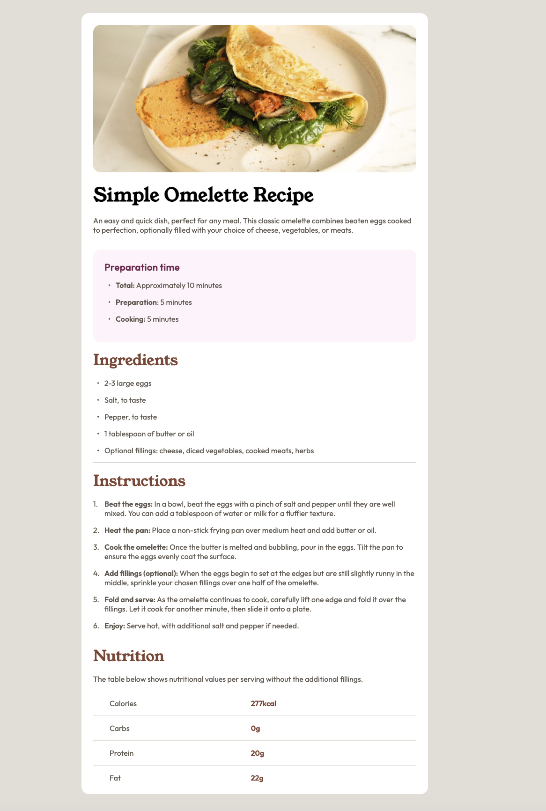

# Frontend Mentor - Solution du composant QR code

Voici une solution au [challenge QR code component sur Frontend Mentor](https://github.com/isamu64/page-de-recette). Les challenges Frontend Mentor vous permettent d'améliorer vos compétences en programmation en réalisant des projets réalistes.

## Aperçu

### Capture d'écran

### Liens

- URL de la solution sur GitHub : https://github.com/isamu64/page-de-recette
- URL du site en ligne : https://isamu64.github.io/page-de-recette/
- URL du challenge : https://www.frontendmentor.io/learning-paths/getting-started-on-frontend-mentor-XJhRWRREZd/challenge/65e6f48617e502f0b6ca3d02/start

## Mon processus

### Description du challenge

Créer la page d'une recette incluant un tableau et des listes à puce.

### Technologies utilisées

- Balisage HTML5 sémantique
- Propriétés personnalisées CSS

### Ce que j'ai appris

Ce challenge m'a permis de mieux comprendre les tableaux et la gestion des colonnes, la création de puces aussi.

### Développement continu

Je veux continuer à utilisé massivement HTML, CSS, Flexbox et bien d'autres choses comme Grid ou Javascript par la suite.
Apprendre Figma ainsi que l'UX/UI.

### Ressources utiles

- [MDN](https://developer.mozilla.org/fr/) - Site indispensable pour comprendre HTML et CSS. Coupler avec l'IA pour encore plus éclaircir les notions qui peuvent être parfois difficile à comprendre juste en lisant ce site.

### Collaboration avec l'IA

J'ai utilisé Chat GPT pour m'aiguiller lorsque j'étais bloqué. Il me fournis des indices petit a petit par moment mais parfois je reste dans une boucle infernale si je fonctionne comme ça. Alors je lui demande la solution quand je suis vraiment bloqué et que ces indices ne m'aident pas sur le moment et je lui demande qu'il m'explique afin de mieux comprendre la solution qu'il me propose.

## Auteur

- Frontend Mentor - [@isamu64](https://www.frontendmentor.io/profile/isamu64)
